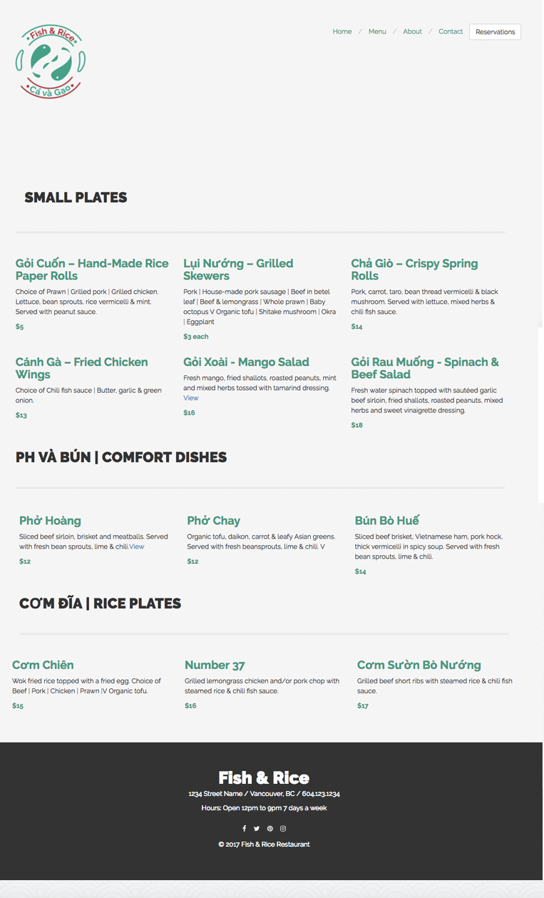

# Restaurant Website

This is an web app made with a Ruby on Rails backend, and is a fictitious Vietnamese restaurant website. It allows the user to make a reservation, and browse the menu, about page, and contact. The contact page includes a google map integration. The front end was compiled using Harp, for a Less, Sass and Bootstrap workflow.

**Technologies Used: Ruby on Rails, CSS, HTML, Less, Sass, Harp, Bootstrap, Postgres, SQL**

### Index Page ###

***

### Menu Page ###

***

### Reservation Modal ###

***
